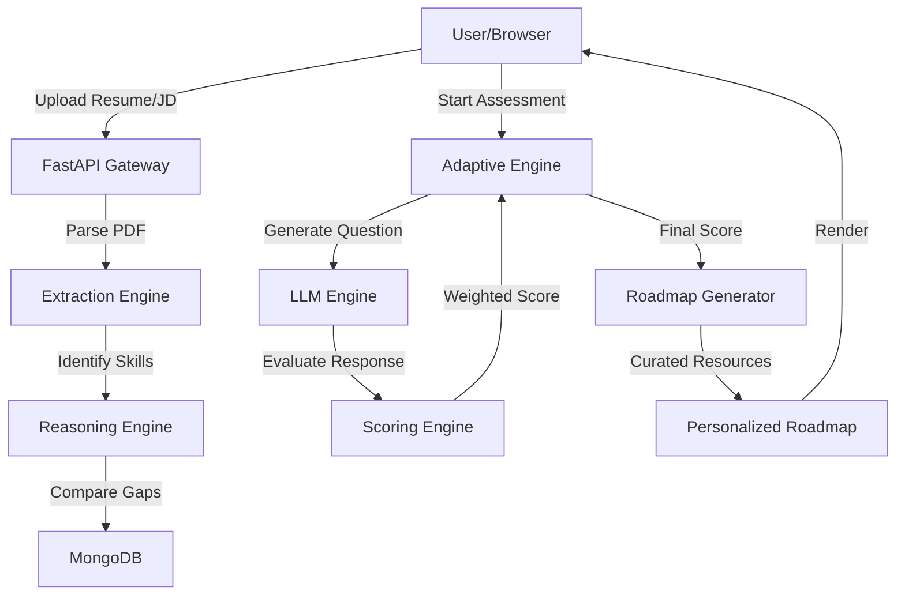

# SkillPath AI 🚀

An intelligent MVP that analyzes resume-job description gaps and conducts conversational AI assessments to generate personalized learning roadmaps.

## 🚀 Features

- **AI Logic Layer**: Structured reasoning using specialized engines for scoring and reasoning.
- **Scientific Scoring**: Weighted evaluation (30% Basic, 30% Intermediate, 40% Scenario) for deep skill validation.
- **Adaptive Questioning**: Dynamic difficulty adjustment based on candidate performance.
- **Adjacent Skill Intelligence**: Recommends "easy-win" skills to maximize career impact.
- **Conversational Assessment**: Interactive chat-based evaluation (not boring MCQs).
- **Personalized Roadmap**: 4-week time-bound learning plan with resources.

## 🛠️ Tech Stack

- **Frontend**: React, Tailwind CSS, Framer Motion, Lucide React.
- **Backend**: FastAPI (Python), Motor (Async MongoDB), OpenAI GPT-4o.
- **Database**: MongoDB.
- **Parsing**: pdfminer.six for robust PDF resume extraction.

## 📁 Project Structure

```
/backend
  /app
    /api          # FastAPI endpoints
    /core         # Config & Prompt Templates
    /db           # MongoDB connection
    /models       # Pydantic schemas
    /services/ai  # AI Engines (LLM, Scoring, Reasoning)
  main.py         # Entry point
/frontend
  /src
    /api          # Axios client
    /components   # Reusable UI
    /pages        # App views
    /styles       # Tailwind config
  tailwind.config.js
```

## ⚙️ Local Setup Instructions

### 1. Prerequisites
Ensure you have the following installed:
- **Python 3.10+**
- **Node.js 18+**
- **MongoDB** (Running locally or a MongoDB Atlas URI)
- **OpenRouter API Key** (or OpenAI Key)

---

### 2. Backend Setup
1. **Navigate to the backend directory:**
   ```bash
   cd backend
   ```
2. **Create a virtual environment:**
   ```bash
   python -m venv venv
   source venv/bin/activate  # On Windows use: venv\Scripts\activate
   ```
3. **Install dependencies:**
   ```bash
   pip install -r requirements.txt
   ```
4. **Environment Configuration:**
   - Copy the example environment file:
     ```bash
     cp .env.example .env
     ```
   - Open `.env` and add your credentials:
     ```env
     OPENAI_API_KEY=your_key_here
     MONGODB_URI=mongodb://localhost:27017
     DATABASE_NAME=skillpath_ai
     ```
5. **Start the server:**
   ```bash
   uvicorn main:app --reload
   ```
   *The API will be available at `http://localhost:8000`*

---

### 3. Frontend Setup
1. **Navigate to the frontend directory:**
   ```bash
   cd frontend
   ```
2. **Install dependencies:**
   ```bash
   npm install
   ```
3. **Start the development server:**
   ```bash
   npm run dev
   ```
   *The dashboard will be available at `http://localhost:3000`*

---

## 🏗️ System Architecture



## 🧠 AI Engine Details

### 1. Agentic Reasoning Layer
Unlike simple keyword matching, SkillPath AI uses a **Reasoning Engine** that:
- **Literal Verification**: Cross-references identified skills with raw resume text to eliminate false positives.
- **Knowledge Proximity**: Identifies "Adjacent Skills"—skills not in the JD but highly relevant to the candidate's existing stack—to maximize career impact.

### 2. Scientific Scoring Engine
Each assessment answer is evaluated across three dimensions using a specialized LLM prompt:
- **Correctness (40%)**: Accuracy of the technical facts provided.
- **Depth (30%)**: Understanding of underlying principles vs. surface-level knowledge.
- **Applicability (30%)**: Ability to apply the skill in a real-world project context.

**Final Score Calculation:**
We use a weighted average across three escalating difficulty levels:
- **Basic (1.0x)**: Foundations and terminology.
- **Intermediate (1.5x)**: Implementation and best practices.
- **Scenario (2.0x)**: High-level problem-solving and architecture.

### 3. Adaptive Difficulty Logic
The assessment doesn't follow a static path:
- **Escalation**: If a candidate scores `> 7/10` on a Basic question, the engine escalates to a Scenario-based question to probe their ceiling.
- **Calibration**: If a candidate struggles, the engine provides immediate feedback and maintains difficulty to stabilize the assessment.

## 🏆 Why This Is Unique
SkillPath AI moves away from boring MCQs. By using **generative AI to probe actual depth of knowledge** through conversation, we ensure candidates are accurately measured. The result is a roadmap that isn't just a generic list, but a surgically precise plan for career growth.
